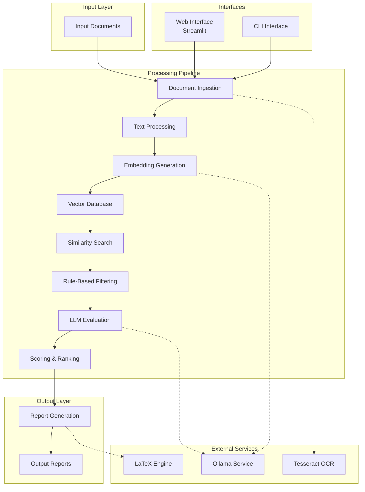

# AI-Powered Tender Evaluation System - Comprehensive Documentation

## Table of Contents
1. [System Architecture & Purpose](#system-architecture--purpose)
2. [Technology Stack](#technology-stack)
3. [Software Development Process](#software-development-process)
4. [RAG (Retrieval-Augmented Generation) Implementation](#rag-retrieval-augmented-generation-implementation)
5. [Ollama Integration](#ollama-integration)
6. [Complete System Documentation](#complete-system-documentation)
7. [Future Scope](#future-scope)

---

## System Architecture & Purpose

The AI-Powered Tender Evaluation System is an advanced automated solution designed to streamline the evaluation of tender proposals against organizational requirements. The system leverages artificial intelligence, semantic analysis, and large language models to provide objective, consistent, and efficient evaluation of vendor proposals.

### Core Functionality
- **Automated Document Processing**: Handles PDF and TXT formats with OCR fallback for scanned documents
- **Semantic Analysis**: Uses vector embeddings to understand context and meaning beyond keyword matching
- **Multi-Criteria Evaluation**: Assesses proposals based on technical, financial, timeline, and certification criteria
- **Intelligent Scoring**: Applies weighted scoring algorithms with AI-powered analysis
- **Professional Reporting**: Generates comprehensive evaluation reports in LaTeX/PDF format
- **Rule-Based Filtering**: Applies configurable business constraints and requirements

### Intended Use Cases
- Government procurement departments evaluating vendor proposals
- Corporate organizations managing tender processes
- Educational institutions handling RFPs
- Healthcare organizations procuring services
- Construction companies evaluating contractor bids

### System Architecture Diagram


### Key Components

#### 1. Document Ingestion (`src/ingestion/document_loader.py`)
- Handles PDF and TXT file formats
- Uses `pdfplumber` for text extraction from PDFs
- Implements OCR fallback using `pytesseract` for scanned documents
- Maintains document metadata including source file information

#### 2. Text Processing (`src/parsing/text_processor.py`)
- Uses `RecursiveCharacterTextSplitter` for intelligent document chunking
- Configurable chunk size and overlap
- Metadata enrichment for documents

#### 3. OCR Processor (`src/ocr/ocr_processor.py`)
- Processes scanned PDF documents using optical character recognition
- Integration with `pytesseract` for OCR processing
- PDF to image conversion using `pdf2image`
- Preprocessing for improved OCR accuracy

#### 4. Embedding Generation (`src/embeddings/embedding_generator.py`)
- Integration with Ollama for embedding generation
- Uses `nomic-embed-text` model by default
- Fallback to simulated embeddings when Ollama is unavailable
- Batch processing for improved performance

#### 5. Vector Database (`src/vector_db/vector_store.py`)
- Supports both FAISS and Chroma vector databases
- Persistent storage capabilities
- Integration with Ollama embeddings
- Fallback mechanisms for unavailable services

#### 6. Similarity Search (`src/search/similarity_search.py`)
- Cosine similarity calculations for vector comparisons
- TF-IDF based text similarity as fallback
- Ranking of applicants based on similarity scores
- Integration with vector store for efficient searching

#### 7. Rule-Based Filtering (`src/filtering/rule_filter.py`)
- Budget constraint filtering
- Timeline requirement filtering
- Certification requirement checking
- Regex-based information extraction

#### 8. LLM Evaluation (`src/evaluation/llm_evaluator.py`)
- Integration with Ollama LLM service
- Structured evaluation prompts for consistent responses
- Parsing of LLM responses into structured data
- Fallback to simulated evaluations

#### 9. Report Generation (`src/reporting/report_generator.py`)
- LaTeX template-based report generation
- PDF compilation using `pdflatex`
- Fallback to text reports when LaTeX is unavailable
- Comprehensive formatting and styling

---

## Technology Stack

### Programming Languages
- **Python 3.8+**: Core programming language for the entire system
- **LaTeX**: Document preparation system for professional reports

### AI/ML Frameworks and Models
- **LangChain**: Framework for developing applications with LLMs
  - `langchain==0.3.0`
  - `langchain-community==0.3.0`
  - `langchain-core==0.3.0`
- **Ollama**: Local LLM service for embeddings and evaluation
  - `ollama==0.1.7`
- **nomic-embed-text**: Model for generating document embeddings
- **llama3.1/tinydolphin**: Models for LLM evaluation

### Document Processing Tools
- **pdfplumber==0.10.4**: Alternative PDF text extraction
- **PyMuPDF==1.23.21**: PDF processing library
- **Pillow==10.0.1**: Python Imaging Library for OCR preprocessing
- **Docling**: Advanced document processing and conversion

### OCR Systems
- **pytesseract==0.3.10**: OCR processing (requires Tesseract installation)
- **pdf2image**: PDF to image conversion for OCR

### Database/Vector Storage Solutions
- **ChromaDB==0.4.22**: Vector database for embedding storage
- **FAISS**: Facebook AI Similarity Search (alternative option)

### UI Framework
- **Streamlit==1.28.0**: Web application framework for the professional interface
- **Jinja2==3.1.2**: Template engine for report generation

### LaTeX/PDF Generation Tools
- **pdflatex**: LaTeX compiler for PDF generation
- **MiKTeX** (Windows) / **TeX Live** (Linux/Mac): LaTeX distributions

### Supporting Libraries
- **numpy>=1.26.0**: Numerical computing
- **pandas>=2.1.1**: Data manipulation
- **scikit-learn>=1.3.2**: Machine learning library
- **pydantic==2.7.4**: Data validation and settings management
- **python-dotenv==1.0.0**: Environment variable management
- **yaml**: Configuration file processing

---

## Software Development Process

### Coding Standards
- Modular architecture with clear separation of concerns
- Consistent naming conventions (snake_case for Python)
- Comprehensive docstrings for all classes and methods
- Type hints for improved code readability and IDE support
- Error handling with graceful fallback mechanisms

### Testing Procedures
- Unit tests for individual components
- Integration tests for pipeline workflows
- Error scenario testing with fallback validation
- Performance testing for large document sets
- Compatibility testing across different environments

### Deployment Practices
- Containerization support (Docker configuration)
- Configuration management through YAML files
- Environment-specific settings
- Dependency management via requirements.txt
- Version control with Git

---

## RAG (Retrieval-Augmented Generation) Implementation

### Document Ingestion Pipeline
1. **Text Extraction**: Extract text from documents using appropriate methods
   - PDF: Use `pdfplumber` first, fallback to OCR if needed
   - TXT: Direct text reading
2. **Preprocessing**: Clean and normalize text content
3. **Chunking**: Split large documents into manageable pieces
4. **Metadata Enrichment**: Add source information and processing metadata

### Embedding Generation Process
1. **Model Initialization**: Connect to Ollama with `nomic-embed-text` model
2. **Text-to-Vector Conversion**: Transform document content into 384-dimensional vectors
3. **Batch Processing**: Process multiple documents simultaneously for efficiency
4. **Storage**: Save embeddings with corresponding document metadata

### Vector Database Operations
1. **Index Creation**: Build searchable index of document embeddings
2. **Persistence**: Store vector database for future queries
3. **Query Processing**: Transform search queries into embedding vectors
4. **Similarity Search**: Find most relevant documents using cosine similarity

### Retrieval Mechanism
1. **Query Embedding**: Convert user requirements into vector representation
2. **Similarity Matching**: Compare with stored document embeddings
3. **Ranking**: Order results by relevance score
4. **Context Assembly**: Retrieve relevant document portions for LLM evaluation

### RAG Workflow Integration
```
Requirements + Proposals → Embedding Generation → Vector Storage → Similarity Search → Ranked Results → LLM Context
```

---

## Ollama Integration

### Model Configuration
- **Base URL**: `http://localhost:11434` (default)
- **Embedding Model**: `nomic-embed-text`
- **LLM Model**: `tinydolphin:latest` (configured in config.yaml)

### API Interactions
- **Health Check**: Verifies Ollama server availability
- **Model Verification**: Confirms required models are available
- **Request Timeout**: 120 seconds for LLM responses
- **Connection Pooling**: Efficient resource management

### Embedding Generation
- **Batch Processing**: Multiple documents processed simultaneously
- **Dimensionality**: 384-dimensional vectors for nomic-embed-text
- **Fallback Mechanism**: Simulated embeddings when Ollama unavailable
- **Error Handling**: Graceful degradation without service disruption

### LLM Evaluation Process
- **Prompt Engineering**: Structured evaluation prompts with specific format requirements
- **Response Parsing**: Extract structured data from LLM responses
- **Evaluation Criteria**:
  - Overall compliance score (0-100)
  - Technical match score (0-100)
  - Financial match score (0-100)
  - Timeline match score (0-100)
  - Detailed explanations and recommendations

### Fallback Strategies
- **Simulation Mode**: When Ollama server is unavailable
- **Content Analysis**: Determines document type (proposal vs. resume vs. certificate)
- **Deterministic Scoring**: Consistent results based on content analysis
- **Keyword Extraction**: Identifies relevant terms for evaluation

---

## Complete System Documentation

### Installation Guide

#### Prerequisites
1. **Python 3.8 or higher**
2. **Ollama** (for embeddings and LLM evaluation)
3. **LaTeX distribution** (MiKTeX for Windows, TeX Live for Linux/Mac) for PDF generation
4. **Tesseract OCR** *(optional)* for scanned PDFs

#### Installation Steps
1. **Clone the Repository**
   ```bash
   git clone <repository-url>
   cd tender-proposal-evaluation-system
   ```

2. **Install Dependencies**
   ```bash
   pip install -r requirements.txt
   ```

3. **Install Ollama**
   - Download and install from [https://ollama.com/](https://ollama.com/)

4. **Pull Required Models**
   ```bash
   ollama pull nomic-embed-text
   ollama pull tinydolphin:latest
   ```

5. **Install LaTeX Distribution**
   - **Windows**: Install MiKTeX from [https://miktex.org/](https://miktex.org/)
   - **Linux**: `sudo apt-get install texlive-full`
   - **MacOS**: Install MacTeX from [https://www.tug.org/mactex/](https://www.tug.org/mactex/)

### Configuration Management

#### Main Configuration (`config/config.yaml`)
```yaml
# Ollama settings
ollama:
  base_url: "http://localhost:11434"
  embedding_model: "nomic-embed-text"
  llm_model: "tinydolphin:latest"

# Vector database settings
vector_db:
  type: "faiss"  # or "chroma"
  persist_directory: "./data/vectorstore"

# OCR settings
ocr:
  enabled: true
  language: "eng"

# File paths
paths:
  org_documents: "./data/org_documents"
  applicant_documents: "./data/applicant_documents"
  output_reports: "./data/reports"

# Processing settings
processing:
  chunk_size: 1000
  chunk_overlap: 200
  top_k_results: 10

# Evaluation settings
evaluation:
  max_applicants: 10
  min_score_threshold: 70
  scoring_weights:
    technical_compliance: 0.4
    budget_compliance: 0.3
    timeline_compliance: 0.2
    certification_compliance: 0.1

# Report settings
report:
  template_path: "./templates/report_template.tex"
  output_path: "./data/reports"
```

#### Rules Configuration (`config/tender_rules.yaml`)
```yaml
# Budget rules
budget:
  max_budget: 1000000  # Maximum budget in currency units
  currency: "USD"

# Timeline rules
timeline:
  max_duration_months: 24  # Maximum project duration in months

# Certification requirements
certifications:
  required:
    - "ISO 9001"
    - "ISO 14001"
  preferred:
    - "ISO 45001"
    - "CMMI"

# Technical requirements (used for semantic matching)
technical_requirements:
  - "Experience in software development"
  - "Knowledge of cloud platforms"
  - "Security compliance experience"
  - "Project management certification"

# Scoring weights for different evaluation criteria
scoring_weights:
  technical_compliance: 0.4
  budget_compliance: 0.3
  timeline_compliance: 0.2
  certification_compliance: 0.1

# Evaluation thresholds
evaluation_thresholds:
  minimum_score: 70  # Minimum score to be considered
  shortlist_count: 10  # Number of top applicants to shortlist
```

### Usage Instructions

#### Web Interface Mode
```bash
streamlit run src/interfaces/professional_streamlit_app.py
```
Access the web interface at `http://localhost:8501`

#### CLI Mode
```bash
python main.py --mode cli
```
Or directly:
```bash
python src/interfaces/cli_app.py
```

#### Demo Mode
```bash
python main.py --mode demo
```

### API References

#### Core Classes

**ConfigLoader** (`src/utils/config_loader.py`)
- `__init__(config_path)`: Initialize with configuration file path
- `get(key_path, default)`: Get configuration value using dot notation
- `get_ollama_config()`: Get Ollama-specific configuration
- `get_vector_db_config()`: Get vector database configuration

**EmbeddingGenerator** (`src/embeddings/embedding_generator.py`)
- `__init__(config)`: Initialize with configuration
- `generate_embeddings(texts)`: Generate embeddings for text list
- `generate_document_embeddings(documents)`: Add embeddings to document metadata

**LLMEvaluator** (`src/evaluation/llm_evaluator.py`)
- `__init__(config)`: Initialize with configuration
- `evaluate_applicants(requirements, applicants, max_applicants)`: Evaluate applicant documents
- `_simulate_evaluation(applicants)`: Simulate evaluation when LLM unavailable

**ReportGenerator** (`src/reporting/report_generator.py`)
- `__init__(template_dir, output_dir)`: Initialize with template and output directories
- `generate_evaluation_report(requirements, evaluated_applicants, report_title, generation_date)`: Generate standard report
- `generate_tec_format_report(requirements, evaluated_applicants, report_title, generation_date, tender_title, department_name)`: Generate TEC format report

### Troubleshooting Guide

#### Common Issues and Solutions

1. **Ollama Connection Issues**
   - **Problem**: Cannot connect to Ollama server
   - **Solution**: Ensure Ollama is running with `ollama serve`

2. **Model Not Found**
   - **Problem**: Model 'xyz' not found
   - **Solution**: Pull required models with `ollama pull model_name`

3. **LaTeX Compilation Failure**
   - **Problem**: PDF compilation fails
   - **Solution**: Install MiKTeX or TeX Live distribution

4. **Memory Allocation Errors**
   - **Problem**: Out of memory during processing
   - **Solution**: Reduce chunk sizes in configuration

5. **OCR Processing Issues**
   - **Problem**: Scanned documents not processed correctly
   - **Solution**: Install Tesseract OCR and configure in settings

#### Error Handling Mechanisms

1. **Ollama Unavailable**: Falls back to simulated embeddings and evaluations
2. **LaTeX Missing**: Generates LaTeX source files that can be compiled manually
3. **OCR Failures**: Graceful degradation to text-based processing
4. **PDF Processing Issues**: Multiple fallback mechanisms for text extraction
5. **Network Issues**: Retries with timeouts and alternative processing

### Performance Optimization

#### Memory Management
- Batch processing for embedding generation
- Efficient document chunking to manage memory usage
- Cleanup of temporary files and resources

#### Processing Efficiency
- Parallel processing where applicable
- Caching of computed embeddings
- Optimized similarity search algorithms

---

## Future Scope

### Advanced NLP Integration
- Integration with more sophisticated NLP models
- Enhanced semantic understanding capabilities
- Improved context awareness for evaluation

### Multi-Language Support
- Expanded OCR language capabilities
- Multi-lingual evaluation and reporting
- International tender support

### Enhanced Reporting
- Interactive dashboards and visualizations
- Real-time collaboration features
- Advanced analytics and insights

### Integration APIs
- RESTful APIs for external system integration
- Webhook support for event notifications
- Third-party system connectors

### Machine Learning Enhancement
- Continuous learning from evaluation outcomes
- Adaptive scoring algorithms
- Predictive analytics for tender success

### Scalability Improvements
- Distributed processing capabilities
- Cloud-native deployment options
- Horizontal scaling for large organizations

### Security Enhancements
- Advanced encryption for document processing
- Role-based access controls
- Audit trail for evaluation processes

### Mobile Compatibility
- Mobile-responsive web interface
- Mobile app for evaluation monitoring
- Push notifications for status updates

---

## Conclusion

The AI-Powered Tender Evaluation System represents a comprehensive solution for automating the evaluation of tender proposals. By combining advanced AI technologies with robust document processing capabilities, the system provides organizations with an efficient, objective, and scalable approach to proposal evaluation.

The modular architecture ensures maintainability and extensibility, while the comprehensive error handling and fallback mechanisms guarantee system reliability even under adverse conditions. The system's ability to generate professional reports in standardized formats makes it suitable for formal procurement processes.

With ongoing development and enhancements, the system is positioned to become a leading solution in the procurement automation space, helping organizations save time, reduce bias, and improve the quality of their vendor selection processes.