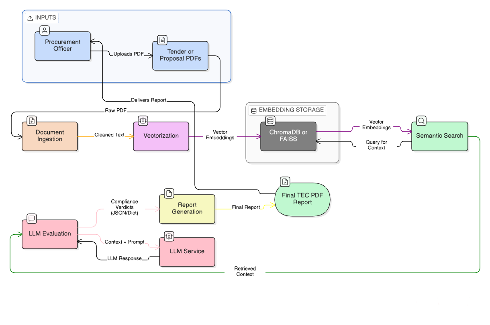
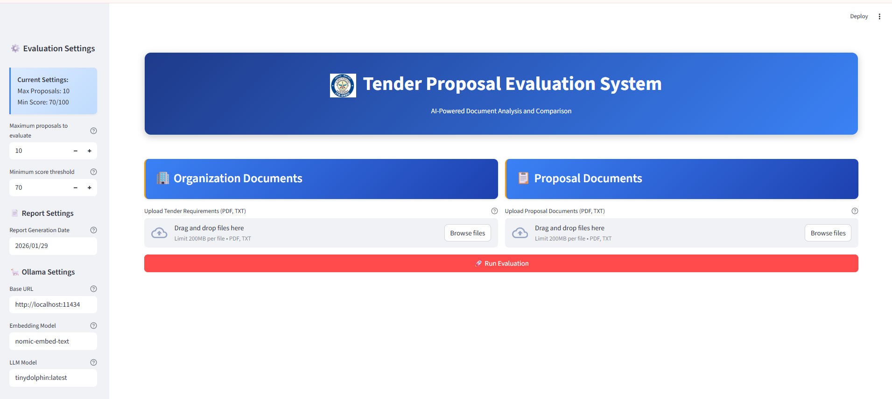
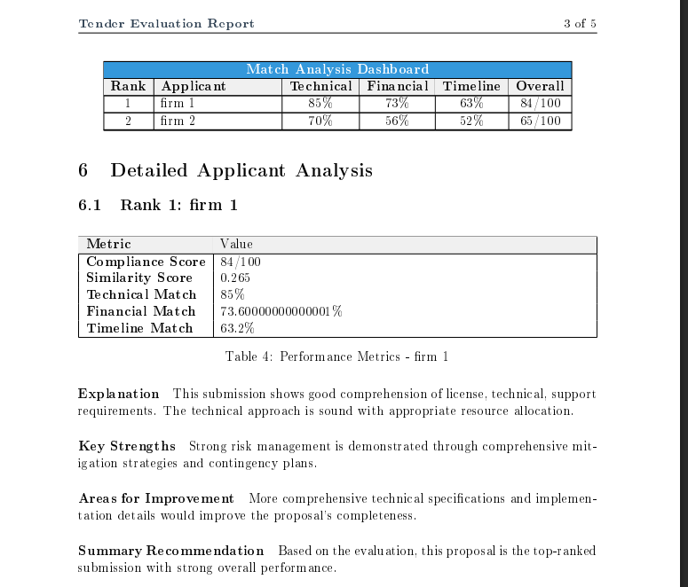

# AI Tender RAG & Reporting System

## Overview

The AI Tender RAG & Reporting System is an end-to-end pipeline designed to automate the grueling process of technical tender evaluation. By leveraging Retrieval-Augmented Generation (RAG) and local Large Language Models (LLMs), it transforms unstructured vendor proposals into structured, objective, and professional LaTeX-formatted TEC reports.

## 💡 The Problem

Manual procurement evaluation is slow, prone to human error, and resource-heavy. Organizations often deal with hundreds of pages of technical specs where keyword matching fails to capture the true intent of a proposal.

## ✨ Key Features

- **Dual-Path Ingestion**: High-fidelity text extraction via pdfplumber with automatic Tesseract OCR fallback for scanned documents
- **Semantic Intelligence**: Utilizes nomic-embed-text and FAISS vector storage for context-aware requirement matching
- **Local & Secure**: Powered by Ollama (Llama 3/Mistral), enabling 100% offline execution
- **Automated LaTeX Reporting**: Generates committee-ready reports with comparison matrices and AI-justified reasoning


## 🛠️ Tech Stack

- **Python 3.8+**: Core implementation
- **Ollama**: Local LLM and embedding models (nomic-embed-text, llama3.1)
- **FAISS**: Vector similarity search
- **LaTeX**: Professional report generation
- **pdfplumber/pymupdf**: PDF processing
- **Streamlit**: Web interface (optional)

## 🚀 Setup

### Prerequisites
- Python 3.8+
- Ollama (https://ollama.com/)
- LaTeX distribution (MiKTeX/TeX Live/MacTeX)

### Installation

1. Install dependencies:
   ```bash
   pip install -r requirements.txt
   ```

2. Install and configure Ollama:
   ```bash
   ollama pull nomic-embed-text
   ollama pull llama3.1
   ```

3. Install LaTeX for PDF generation:
   - Windows: Install MiKTeX
   - Linux: `sudo apt-get install texlive-full`
   - Mac: Install MacTeX

## 🏗️ How It Works

1. **Document Ingestion**: Load organization requirements and candidate proposals
2. **Embedding Generation**: Convert documents to semantic vectors using nomic-embed-text
3. **Similarity Matching**: Find relevant sections using FAISS vector search
4. **Rule-Based Filtering**: Apply configurable evaluation criteria
5. **LLM Evaluation**: Detailed analysis and scoring using local LLMs
6. **Report Generation**: Create professional LaTeX evaluation reports



## 📷 System Screenshots

### UI Interface


### Generated Report Comparison Table


### Generated Report First Page


### Generated Report Content Page


### Detailed Results View


## 📋 Usage

### CLI Mode
```bash
python main.py --mode cli
```

### Configuration
Edit `config/config.yaml` to customize:
- Ollama settings and model selection
- Processing parameters
- Evaluation thresholds
- OCR settings

Business rules can be modified in `config/tender_rules.yaml`.

## 📁 Project Structure

```
├── config/                 # Configuration files
├── src/                    # Source modules
│   ├── embeddings/         # Embedding generation
│   ├── evaluation/         # LLM evaluation
│   ├── filtering/          # Rule-based filtering
│   ├── ingestion/          # Document loading
│   ├── ocr/                # OCR processing
│   ├── parsing/            # Text processing
│   ├── reporting/          # Report generation
│   ├── search/             # Similarity search
│   ├── utils/              # Utilities
│   └── vector_db/          # Vector storage
├── templates/              # LaTeX report templates
└── media/                  # Documentation assets
```

## 📄 License

MIT © Prakash Sahoo

